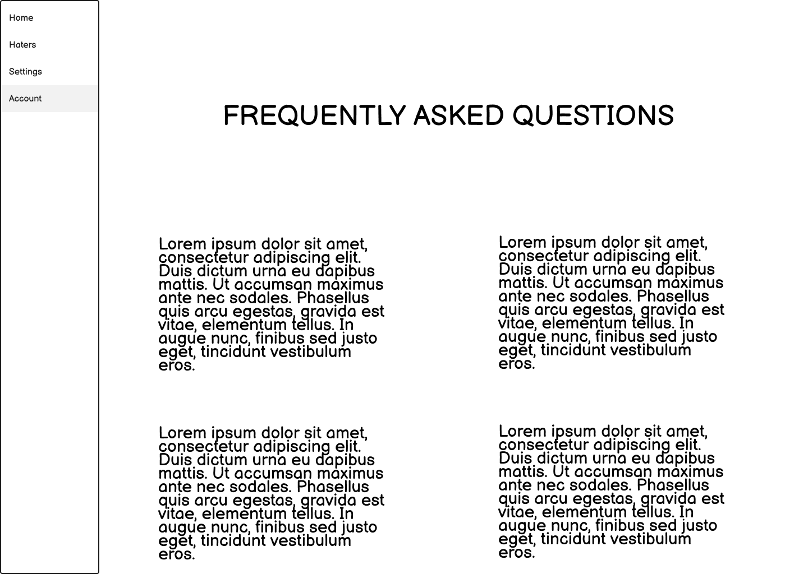

# Wireframes
### Simple Task - As a new user, find a match!

First, let's click Register and create a new account

Enter your information and click register. This will take you to the Match Page, where you can start swiping on potential Archenemies.

Interacting with this page will store your likes, and alert you when a match is made! A number will appear next to the Haters bar on the left when a match is found. Click Haters to move to that window.

Once here, each matched Hater's profile image will appear as a little bubble on the right. Select any face to start a dialouge in the Chat Page.

This is where the magic happens. Send messages in real time to start hating! Congradulations, we have completed the simple scenario! Below are more wireframes that can be accessed by interacting with the website.

Login Page: This is where you will login if singed out.

Account Management Page: Where you go to update your profile and upload new profile images.

Settings Page: A place to change settings of the website. More to come.

Delete Account Page: Hopefully you don't have to leave! The option is always there though.

Help Page: Common questions and their answers.

